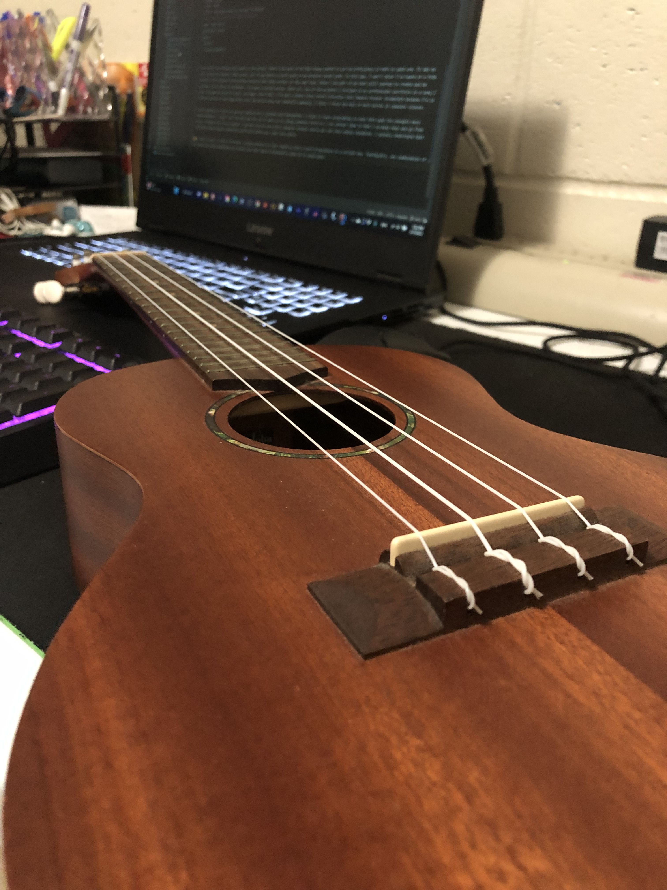

I see myself as someone with hands in two worlds. There’s the part of me that always wanted to put my proficiency in math to good use. It was my best subject throughout high school, but it was hardly a focal point in my previous career path. To this day, I don't know a film director, if any, that actually incorporated calculus into their movies. At the same time, there’s the part of me that still yearned to create and be creative. Ever since my childhood, I’ve been a musical person. After all, one of the projects I included in my professional portfolio is a song I wrote. My appreciation for music runs deep. Since 2021, I’ve kept a modest vinyl record collection that remains forever incomplete because I’m in constant search of new songs that color the world around me. Generally speaking, I think I found the best of both worlds in computer science.

## The 4-7-3-6-2-5-1 to put my mind at ease

In the beginning of this new journey coming from a creative arts background, I tried to learn programming in ways that made the concepts more understandable. I found that the best way for me to learn is by seeing examples first so I can connect them to what I already know and go from there. Probably the first concept I learned from my very first computer science course was the Java coding standards. Over time I made the connection that writing code is a bit like writing a song: the language is your instrument and its coding standards are the key the song is in. Not following the coding standards may not have an effect on whether code runs as intended, but it would make it look pretty otherwise. Similarly, a songwriter is not required to stay in the key at all times; rather, the key is a guide in composing melodies and chord progressions that make sense and sound good. If someone wanted to play the song themselves, they can look up its tabs/sheet music and it would sound mostly the same.

If this class was using C/C++, my analogy would make for a half-decent pun, but unfortunately I cannot because we're using JavaScript. Nonetheless, learning coding standards was helpful for the first-time programmer I was back then. Learning how certain data types and data structures worked while learning how to properly apply them in code was crucial for me to catch on to these concepts quickly. I also took advantage of the strong encouragement of commenting. However, at the end of the day, the only ways I'd be able to know whether I was in tune with the coding standards was by compiling, running, or a proofread from my professor. Those options required clicking--what if for some reason I didn't want to click with my mouse?

## ESLint: pitch correction for your code

As the class transitioned IDEs from JSFiddle to IntelliJ IDEA, a JavaScript coding standard came with us: ESLint. It's set up in IDEA so that *while* you're coding, it automatically detects possible fixes. Every day I grow more and more grateful for ESLint. The past few weeks working with JSFiddle weren't necessarily difficult, but the amount of times I had to figure out on my own how to fix code errors was a major inconvenience. I don't have to go through that kind of hassle anymore with ESLint. I get to learn about the quirks of good-looking JavaScript code through the errors it gives me. Not only that, but I've become more conscious about the decisions I make with each line. "Why did you use "const" here?" "Why declare this variable if you're not going to use it at all in your program?" "Use single-quotes here instead of double-quotes." They're not errors per se, but things to think about when coding. Getting rid of all the errors is a new mini-game for me. It's another small victory when all that's left on the top right corner of the window is a green checkmark. 

I think overall being required to follow a coding standard when you're learning a new programming language is extremely helpful. It gives you a chance to get a firm grip on the ins and outs of the language sooner rather than later. You also develop good habits that uphold the standards, such as frequently writing comments. In the case of ESLint, you're encouraged to be an efficient programmer. Every line must be purposeful, not a single bit of memory wasted. It's not so different from writing a melody. So, what masterpiece shall we play today?