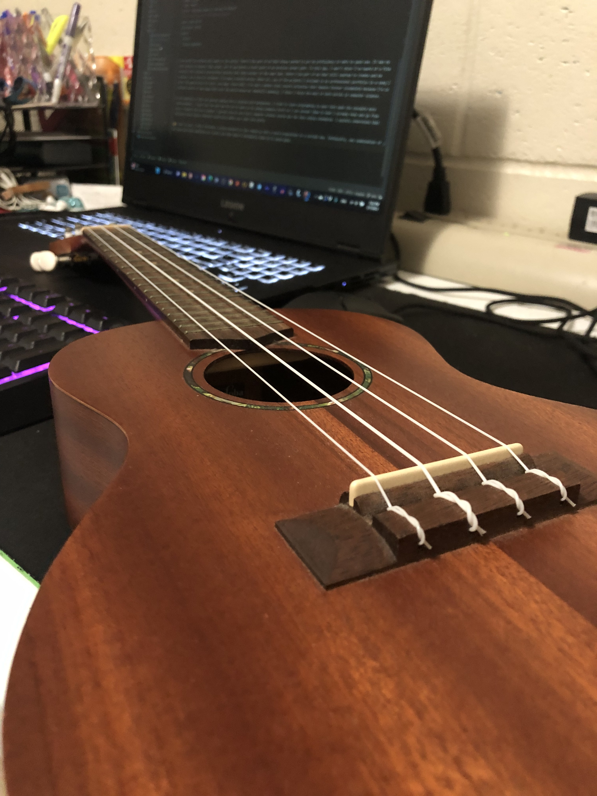

I see myself as someone with hands in two worlds. There’s the part of me that always wanted to put my proficiency in math to good use. It was my best subject throughout high school, but it was hardly a focal point in my previous career path. To this day, I don't know a film director, if any, that actually incorporated calculus into their movies. At the same time, there’s the part of me that still yearned to create and be creative. Ever since my childhood, I’ve been a musical person. After all, one of the projects I included in my professional portfolio is a song I wrote. My appreciation for music runs deep. Since 2021, I’ve kept a modest vinyl record collection that remains forever incomplete because I’m in constant search of new songs that color the world around me. Generally speaking, I think I found the best of both worlds in computer science.

# Writing code is like writing songs

In the beginning of this new journey coming from a creative arts background, I tried to learn programming in ways that made the concepts more understandable. I found that the best way for me to learn is by seeing examples first so I can connect them to what I already know and go from there. Probably the first concept I learned from my very first computer science course was the Java coding standards. Over time I made the connection that writing code is a bit like writing a song, and that the coding standards are sort of like the key the song is in. You don't have to follow the coding standards, but they do make your code look pretty. Similarly, a songwriter is not required to stay in the key at all times; rather, it is a guide in composing melodies and chord progressions that make sense and sound good. If this was a class on C, this analogy would make for a good pun, but unfortunately I cannot because we're using JavaScript in this class. 

