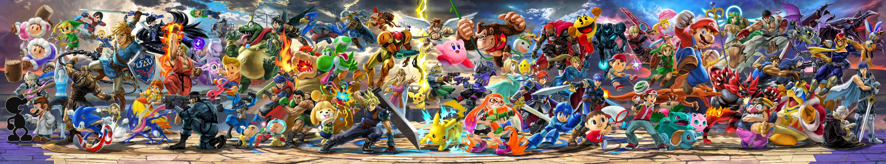

    

One of my favorite games from my childhood that I still play to this day is _Super Smash Bros._ It's a party fighting game for Nintendo consoles where you play as iconic characters throughout video game history and try to knock your opponent(s) out of the screen. As a kid I used to play _Super Smash Bros. Melee_ on the GameCube. I wasn't any good at the game -- my 4-year-old pea brain had no idea what I was doing -- but I'd still have a blast playing. It was when I entered high school that I seriously wanted to get better at Smash. There was an esports club at school that specialized in Project M, a modded version of _Super Smash Bros. Brawl_ on the Wii which made gameplay feel similar to _Melee_. It had been a long time since I played Smash, but in that time I had grown interest in entering the competitive scene in some capacity. I figured joining the esports club was my way in.

## _Super Smash Bros._ but it's an analogy for design patterns

Before I continue, I feel obliged to explain a bit more about how a kids game could spawn such a massive and dedicated competitive scene that continues to grow till this day. When played at the highest level, Smash is a fast-paced and highly complex fighting game. With traditional fighting games like _Street Fighter_ and _Tekken_, you have to attack your opponent until they run out of health, and the best way to do that is by performing attack combinations, or combos. Normally these combos can only be executed by pressing a specific sequence of buttons on your controller. The beauty of Smash is that combos can be created on the fly by the player, and the level of difficulty in executing these often-improvised combos is through the roof. It's for that reason that clips like the legendary [wombo combo](https://www.youtube.com/watch?v=pD_imYhNoQ4) include such explicitly strong and exciting reactions. In addition, despite the simple controls, the finer details are what gives Smash its complexity. Matches can be won by the margin of a single pixel or frame. Split-second decisions are made all throughout the match, hence you need to be on your toes when you have the controller in hand.

Now I digress. The first couple of weeks in the esports club consisted of many losses. These losses were rarely ever close affairs. I'm pretty sure I was the worst player in the club at that time. I was losing to everyone left and right. I knew the fundamentals, but it's hard to apply them when being juggled in the air with nothing else to do but to accept defeat. Whenever I was not getting hit, I would just throw literally any move at my opponent hoping something would land, until I leave myself open for another merciless combo. 

## Applying the mindset to programming

