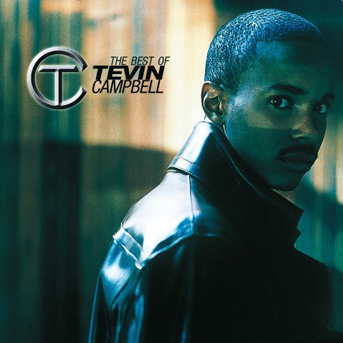

At the beginning of every semester since I've been at Manoa (which at this point is only two), I create a playlist on my Spotify, adding songs every so often throughout the semester. The goal by the end of finals week is to have a sort of time capsule of what I was listening to the past few months. To needlessly back it up, here's my [shameless plug of my music taste](https://open.spotify.com/playlist/1LdRIjPUl21IHQcmQezdC1?si=7ad1790c401a45ed) during this Spring 2023 semester.

Just as my playlist compiled songs as the semester progressed, so have I gradually gained knowledge and experience in software engineering this semester in ICS 314. We've learned various fundamental topics of software engineering under the backdrop of web development, but they can generally be applied to other areas in the field. In fact, some can even apply outside of computer science altogether. In this essay I will discuss two topics I learned this semester, connecting them to a song that's actually on the playlist I linked above.

## Open Source Development: Tevin Campbell - Can We Talk

In this 90s R&B classic produced by the legendary Babyface, Tevin Campbell sings about building up his confidence to walk up and talk to a girl he had been admiring from a distance. If I had the pipes for this song I'd be belting it in the shower every morning. He sings so high, but it's what makes this song one I always come back to.

_"But just like a baby, I could not talk / And I tried to come closer, but could not walk / And I think of it every night / How I just could not get it right, oh"_

Somehow I relate "Can We Talk" to open source software development -- namely, how to participate in the open source community without making a fool of yourself. The beautiful thing about open source development is that source code can be available for everyone to use and play around with themselves. Of course, there's a lot more nuance to that statement, but ultimately it's there. From this, one can also seek feedback from other programmers on how to improve their source code in the case debugging struggles. However, the open source community can be sassy, for lack of a better word. Should you ever be stumped on a coding assignment and think about consulting the good people on Stack Overflow for help, you need to make sure not to be shut down with a snarky did-you-read-the-manual response.

First things first, see if your issue has been solved before on a site like Stack Overflow. If the solution provided works for you, then there's no need to ask further. Otherwise, you'll need to present your issue as a smart question. All the necessary details need to be crystal clear. If you are dealing with multiple issues in your code, focus on only one and provide the relevant code. This way readers are not left having to imagine what to do to help, and they can respond in a timely manner.

## Coding Standards: Porter Robinson - Blossom

This is probably the saddest happy love song I've ever listened to. Porter Robinson's sophomore album _Nurture_ is one of my favorite albums ever. I'm dying to get it on vinyl to add to my collection. "Blossom" is a deep cut in the record, and in stark contrast to the enchanting folk-inspired synthpop, the song is an acoustic guitar ballad more akin to a lullaby. 

_"Oh, it's not alright, that one day we're all out of time / I'll write you another life, I'm sorry for crying / It's just that I love you / "One day" can't be far enough"_

"Blossom" is the kind of song I wish I was able to write. I don't know if I mentioned this in my previous essays, but when I got my ukulele for my 18th birthday, I spent day and night writing songs. Best-case they were cute songs; worst-case they were unbearably corny. Nonetheless, during songwriting, I would normally want to stick to the key that I'd decide for a song I'd be working on. Keep the chords within the key along with the melody. It's sort of like when you're coding, you follow a coding standard to maintain cleanliness and clarity. A particular aspect of coding standards that I found to be very important is commenting. When other people are looking at your code, it will most likely take them a while to get the gist of what your code does if you don't put comments. 

This semester we worked with JavaScript and its associated coding standard ESLint. I found ESLint to be like pitch correction for your code. When a singer is in the recording booth, sometimes they may miss a few notes here and there. Pitch correction, as the name suggests, manipulates the recorded vocals so that the singer can be on pitch. As the singer strays farther off from the right note, the more the pitch correction turns their voice into something robotic. Auto-Tune is just an exaggerated form of pitch correction. Similarly, ESLint can quickly detect errors or possible errors in your code and offer you quick fixes to those errors. ESLint has been very helpful to me throughout this semester.

## Want a break from the ads?

As I close out my first full year at UH-Manoa, I take with me the experience and knowledge I gained throughout both semesters. Each song I added to my playlist is a memory sealed. I've learned so much in ICS 314 in such a short timespan. I hope the knowledge I gained here will help me as I continue in my computer science journey.
