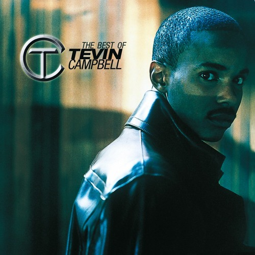

At the beginning of every semester since I've been at Manoa (which at this point is only two), I create a playlist on my Spotify, adding songs every so often throughout the semester. The goal by the end of finals week is to have a sort of time capsule of what I was listening to the past few months. To needlessly back it up, here's my [shameless plug of my music taste](https://open.spotify.com/playlist/1LdRIjPUl21IHQcmQezdC1?si=7ad1790c401a45ed) during this Spring 2023 semester.

Just as my playlist compiled songs as the semester progressed, so have I gradually gained knowledge and experience in software engineering this semester in ICS 314. We've learned various fundamental topics of software engineering under the backdrop of web development, but they can generally be applied to other areas in the field. In fact, some can even apply outside of computer science altogether. In this essay I will discuss two topics I learned this semester, connecting them to a song that's actually on the playlist I linked above.

## Tevin Campbell - Can We Talk

_open source software development_

## Porter Robinson - Blossom

_coding standards_

