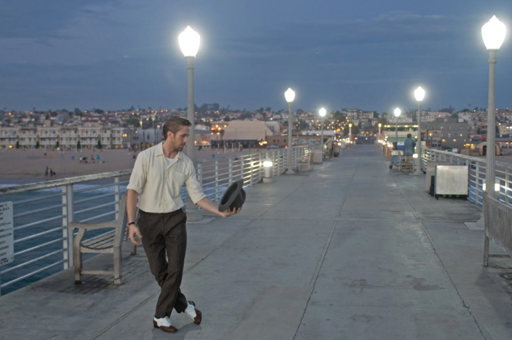

*“City of stars, are you shining just for me? / City of stars, there’s so much that I can’t see / Who knows? / Is this the start of something wonderful and new / Or one more dream that I cannot make true?”* - *La La Land*, 2016

## The start of something wonderful and new

For most of my childhood I thought I figured out what I wanted to do in life. I was going to be a Hollywood film director, winning Academy Awards with my blockbuster films. I wanted to make movies like *Avatar* and *La La Land*, the kind of movies that would transport and immerse the viewer into the worlds that I’d create. I spent 4th grade onwards chasing my childhood dream, but over time that dream became burdensome to hold onto. Each video project I was assigned felt more and more like a chore than the last one. It was a hassle just to pick up a camera and tripod and hit record, and hours of stressful editing led to final cuts I was never proud of. I made every effort to *not* make videos by senior year.

Suddenly, like many high school seniors, I found myself stuck at home at the onset of the pandemic. As each boring day passed, it became clear I needed to face myself and really consider my future. It was then I admitted to myself I didn't want to pursue film anymore. I let the application deadline for USC, my dream college, pass me by. Even if I applied and somehow got accepted, I would have been miserable doing something I no longer enjoyed. So, in search of a new spark, I started fresh at Leeward Community College.

In retrospect, Java might not have necessarily been the ideal first language for me. Regardless, learning the basics of programming in ICS 111 furthered my interest in computer science. There was gratification in writing code that ran perfectly -- it had been a while since I felt that. I understood a lot of the concepts fairly quickly, and I wanted to learn more. I took a chance and switched my major from Liberal Arts to ICS the following semester.

## One more dream that I cannot make true?

It hasn’t been long since then, so I know I have a lot of catching up to do in comparison to my colleagues who have been doing this since high school. To be honest, although my current interests are in game development, I’m not 100% confident that’s the path I want to take in software engineering. At the very least, I want to do something involving programming. Learning JavaScript has been surprisingly fun, dare I say the most fun I’ve had with a coding language so far. Depending on how the rest of ICS 314 goes, I may want to go into web development. In the near future, I would like to continue exploring JavaScript and the opportunities connected to it.

There’s a song by Chris Stapleton called “Starting Over.” In the second verse, he sings, “Nobody wins, afraid of losing, and the hard roads are the ones worth choosing. Someday we’ll look back and smile and know it was worth every mile.” I listened to that song the other day on my way to campus while watching the sunrise. I connected with those lyrics so much I almost cried. Going into my third year in this major, I know all too well that this road hasn’t been easy. Frankly, I still hope that I’m not in over my head with this. I backed out the last time I faced a hard road. It would be unfair to myself to let this second chance go to waste. I’m here to succeed, not to avoid failure.
