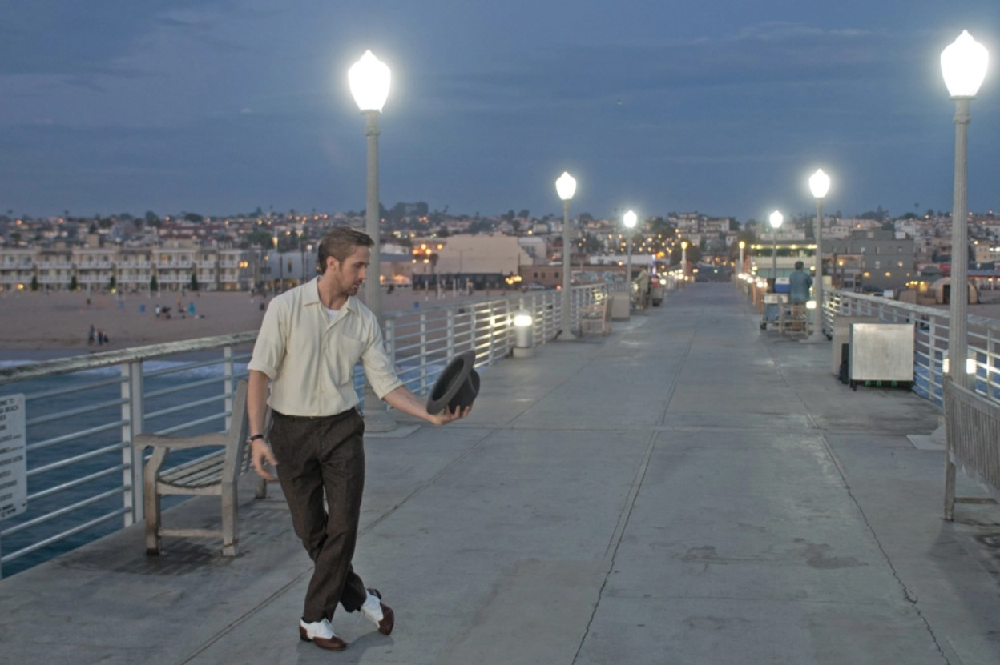

*“City of stars, are you shining just for me? / City of stars, there’s so much that I can’t see / Who knows? / Is this the start of something wonderful and new / Or one more dream that I cannot make true?”* - *La La Land*, 2016

# Nobody wins afraid of losing

For most of my childhood I thought I knew what I wanted to do in life. I was going to be a Hollywood film director, winning Academy Awards with my blockbuster films. I wanted to make movies like *Avatar*, the kind of movies that would transport and immerse the viewer into the worlds that I’d create. I spent 4th grade onwards chasing my childhood dream, but over time that dream became burdensome to hold onto. Each video project I was assigned felt more and more like a chore than the last one. Nothing was up to my standards, and I began to dread every class period of video production. 

Like many high school seniors, I was stuck at home during the first few months of the pandemic. As each day passed, the more I had to face myself and really consider my future. It was then I finally admitted to myself that I didn't want to pursue film anymore. I let the application deadline for USC, my dream college, pass me by. Even if I was accepted, I would have been miserable doing something I no longer enjoyed. So, in search of a new spark, I started from scratch at Leeward Community College.

# The hard roads are the ones worth choosing

In retrospect, Java was not necessarily the ideal first language. Regardless, learning the basics of programming in ICS 111 unlocked an interest in computer science. There was a sense of gratification from writing code that ran perfectly -- it had been a while since I felt that. 

To be honest, although my interests are in game development, I’m not 100% sure if that’s necessarily the path I want to take. It hasn’t been that long since I changed majors, but I know the main thing I want to do is programming.
