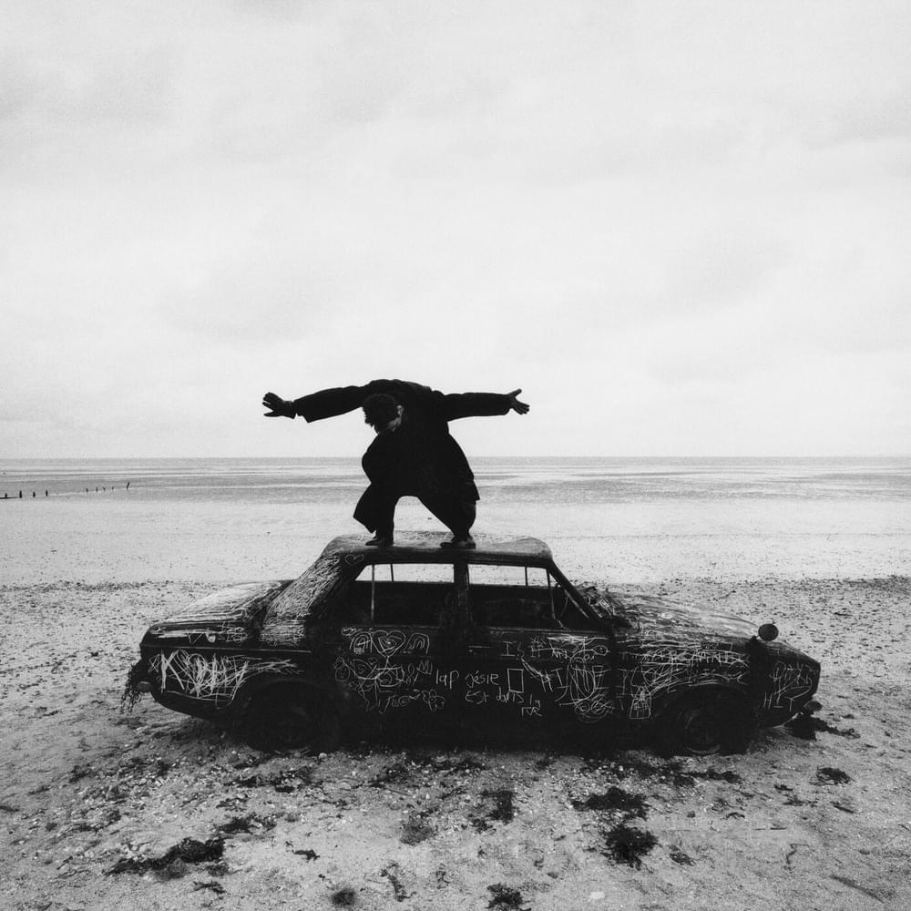

Two semesters ago, when I took ICS 314, I approached the final exam essay with the idea of using my Spotify as a means to showcase what I had learned throughout the semester. As I mentioned before in that essay, at the beginning of every semester I create a new playlist with initially zero songs. Over time, I add songs to the playlist that are either connected to a significant memory or are simply enjoyable. By the end of finals week, I would have created a little time capsule for myself to reflect and reminisce on the last 17 or 18 weeks. Each semester seems to rush on quicker than the last; to already be so close to the finish line of Spring 2024 is startling. Just as I did with ICS 314, I plan to clearly describe my experience in ICS 414 through the lens of [this semester's Spotify playlist](https://open.spotify.com/playlist/0sXG4xCugakEbUZtkwqiaG?si=b6e7a1e741634bed).

## The 1975 - About You | _Do you think I have forgotten?_

_"Do you think I have forgotten about you?"_

Going in, I was actually a bit worried about having waited a semester after 314 to take 414. I hadn't worked on anything with Meteor or React since taking 314, so I was scared that I put myself behind. Over winter break, I retook the freeCodeCamp courses on JavaScript and ES6 to refresh my memory. I prepared as much as I could for this class. Upon learning that I would be working in a group for the entire semester, my worries then shifted to my role in the team. Where would I fit? How would I contribute? On the first day of class, when I settled into my group, I made it clear that it had been a while since I took 314. I remember we went around the table asking what each person was good at, and during my turn I half-jokingly responded, "I just work hard". 

The group size was another thing I was worried about. I didn't want to be one of those teammates that faded into the background and rode the coattails of the people who were actually contributing. However, after the first couple milestones, it honestly felt like I was just there. Even though I was finishing tasks and pushing to main, it paled in comparison to what some of my fellow teammates were doing. I volunteered to lead the code review meetings so I could feel like I was actually doing something.

## LE SSERAFIM - Easy | _If it's hard then I make it easy_ 

_"Yeah, know that I make it look easy"_

Fortunately, as the semester progressed, I found myself growing more comfortable both in my role within the group and in my proficiency with React. Initially drawn to backend development, I soon realized the need for people who were good at styling. Recognizing this need and my own affinity for CSS, I eagerly took on the task. While not everyone shared my enthusiasm for CSS, I welcomed the opportunity to contribute in this area. My role in the group eventually evolved into a sort of "floater". Wherever help was needed, I did my best to alleviate the issue.

## Sabrina Carpenter - Espresso | _I'm working late 'cause I'm a singer_

