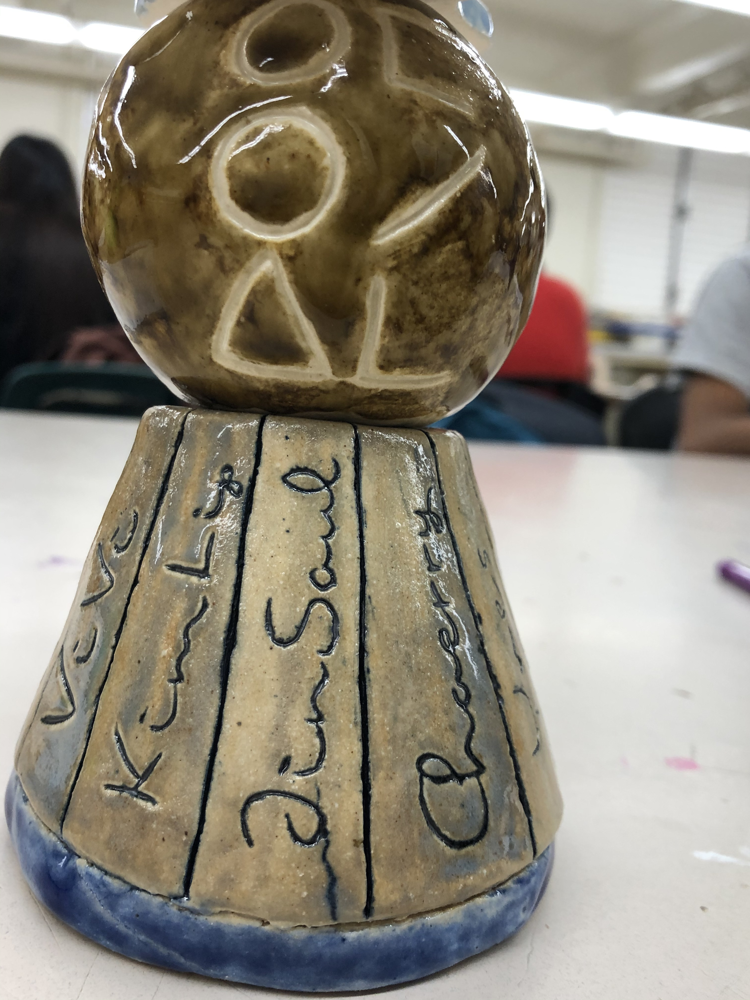
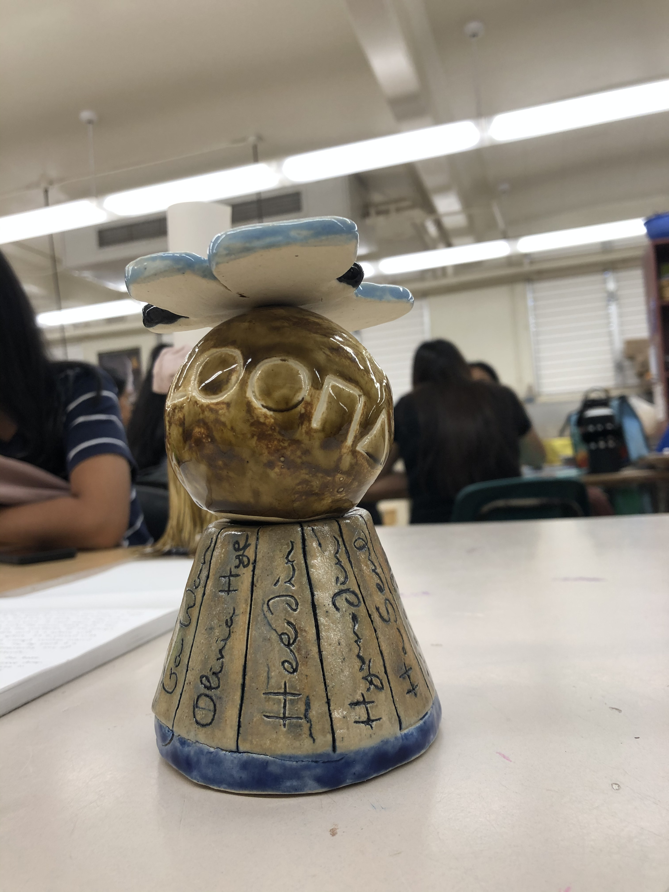
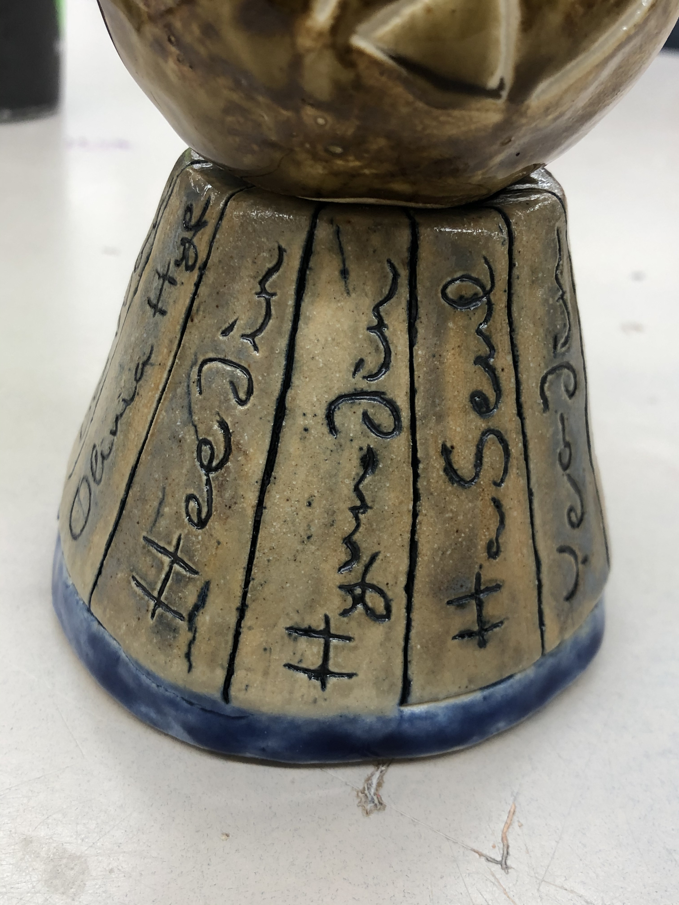

    
    
    

In my senior year of high school, I took ceramics as an elective just for fun. I went into it thinking that it was chill, but I didn't expect putting so much time and effort in the studio. Being the detail-oriented person that I am, I once after school had the studio all to myself just so I could finish one of my projects. Admittedly, I'm extremely proud of all the pieces I made in that class, especially my three-part piece pictured here. Each part of the process was difficult, from molding the clay, to using tools to carve out fine details, to adding the glaze. That’s not even mentioning the stress of waiting and hoping your piece comes out of the kiln in one piece. However, seeing your piece emerge shiny and in color is a rewarding experience, making it all worth it. I was reminded of that enjoyable time when I dived right into HTML, CSS, and my first UI framework in Twitter Bootstrap.

Analogy: HTML is the clay, CSS is the carving tools, the first time the piece is fired up is the raw webpage. Bootstrap is the glaze, and the second time the piece is fired up with the glaze is the new webpage
