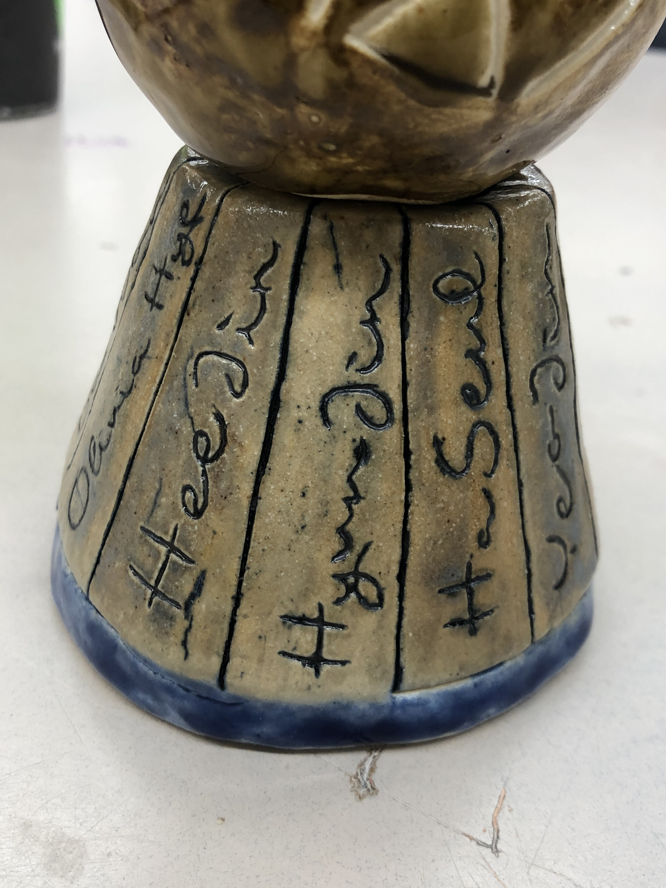

    
    
    

In my senior year of high school, I took ceramics as an elective just for fun. I went into it thinking it would be easy. However, I didn't expect to put so much time and effort into that class. As much as I was allowed to be creatively hands-on, I was also challenged to aim for high quality. Being the detail-oriented person that I am, I once had the studio all to myself after school to work on one project. In retrospect, I'm extremely proud of the pieces I crafted in that class, especially the three-part sculpture pictured above which was a tribute to my favorite K-pop girl group, Loona. Each part of the process was difficult, from molding the clay, to using tools to carve out fine details, to adding the glaze. That’s not even mentioning the stress of waiting and hoping your piece comes out of the kiln in one piece. Nonetheless, seeing each of my sculptures come out of the kiln the way I wanted them is rewarding. I was reminded of that enjoyable time when I dived right into HTML, CSS, and my first UI framework in Twitter Bootstrap.

## Shaping an HTML slab of clay

I had no experience with HTML or CSS prior to ICS 314. Similar to what I went through with JavaScript last month, I took a crash course in HTML and CSS on freeCodeCamp. As I was going through each problem, typing elements like `<h1></h1>` became more ridiculous and cumbersome. Although writing elements is a bit more convenient on IntelliJ because it fills out the closing tag for me, it doesn't do much to make writing HTML any less tedious. It's like starting off with a big slab of clay and trying to shape it with your bare hands. You need to do the general shaping before you can bring out the carving tools. In fact, most of your time working on the sculpture might be spent solely on shaping. If there was a raw HTML equivalent to finishing the general shaping of your sculpture, it would probably look like the picture above. Now it's time to bust out the carving tools.

## Bust out the CSS carving tools

Before you can start adding glaze to your sculpture, you need to fire it in the kiln so that you have a hardened surface to work on. With that, you need to be 100% confident and happy with the shape of your sculpture prior to baking it. More often than not, getting the general shaping down is only the beginning. Your carving tools help to accentuate the finer details of your piece more easily than what your bare hands would be capable of doing. It's like using CSS in a way. You can change the color of the background, the font, the image size when you link your .html file with a style.css stylesheet. You can get specific, like changing the color of one of your `li` elements, or general, like resizing every instance of an `img`. The picture here is of the same page but with a .css file linked to the .html file.

## Time to add the Bootstrap glaze!

 
After playing around with HTML and CSS for a bit, it was time to bring Twitter Bootstrap into the fray. And honestly, I can't imagine life without UI frameworks like Bootstrap. Putting everything together in HTML under the framework provided by Bootstrap became ten times easier. Not only that, but the webpages look downright gorgeous. It's like taking your boring solid sculpture out of the kiln and spicing it up with glaze. It's like paint, but not really. When you fire your glazed piece in the kiln a second time, it should come out looking shiny and in glorious color. This particular analogy is a bit of a stretch, but bear with me. The picture is of the same page but restructured to incorporate Bootstrap. You could show me that picture and put it against the picture of my Loona sculpture and I would say that they're the same in terms of beauty.