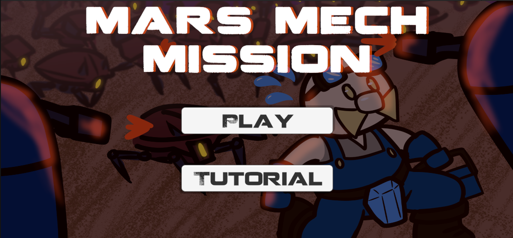
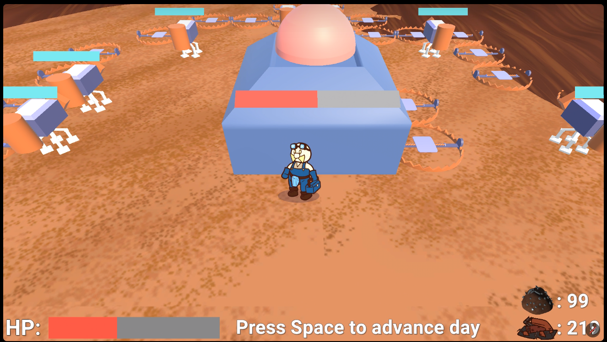
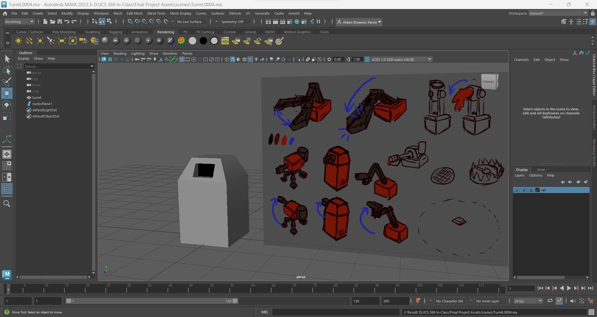

    

_Mars Mech Mission_ is a tower defense game made on Unity, developed as the final project of my team, I3T4, for ICS 369. You play as a crafty mad scientist stranded and alone on an alien desert. The mission is to survive as long as you can, gathering resources to build contraptions during the day, and defending yourself and your base against robot enemies at night. 

The gameplay is simple. There are three stages to each round, or in-game day. During the "morning" phase, you mine titanium ore and pick up scrap metal left by fallen enemies the night before. You can use these materials to build turrets and traps, as well as purchase upgrades to better survive the night. During the "afternoon" phase, you are now able to place down your turrets and traps. You are also able to partially refund what you put down in case you change your mind about placements. In the "evening" phase, your task is to survive. There are two types of robot enemies in the game: a crab-like robot which only targets your base, and a scorpion-like robot which only targets you. Throughout the night, you need to constantly repair your turrets, because they lose health every time they fire. The turret is gone forever when it runs out of health. If you defeat all enemies thrown at you in this phase, your surviving turrets . If you or the base's health drops to 0, it's game over.

I3T4 was comprised of five members, including me, and we had six weeks to develop our game. When we pitched the game to our professor, we admitted that it was ambitious given the time constraint. Each team member was in charge of a singular aspect of the game. Because of this, we turned the Unity project of the game into a shared GitHub repository so each of us could push our work to our respective branches to eventually be merged with the main branch. 

As for my role on the team, I did the majority of the 3D art. I modeled and textured the turret, the trap, and the home base. This was a daunting task for me because I had no prior experience of doing 3D animation -- I just happened to also be taking ACM 215 at the time, which is Introduction to 3D Animation. To create the models, I used Autodesk Maya, the same software we use for ACM 215.

We wanted to incorporate 2D assets with 3D assets, reminiscent of games like _Paper Mario_. Our teammate Kurt was in charge of the 2D art, so he sketched design ideas for the turret and trap, which I used as reference in my modeling. The first few models I made for the turret were more boxy, but lacked the ability to believably spin around on its axis. In addition, funnily enough they also looked like garbage cans found in a mall. The final design of the turret takes inspiration from Killjoy's turret from _Valorant_. I designed the trap to look like a bear trap. I also repurposed one of the rejected designs of the turret to be the top piece of the home base. It was an arduous process, but I'm very proud of the work I've done given my lack of experience going in.

One of my teammates, Ben, made the game playable on browser. You can try out the game [here](https://bencatcraw.itch.io/mmm). You can also check out our presentations to see our development process:
- [Game Pitch](https://docs.google.com/presentation/d/1EuSpYwfkZwH5JoPc1cNMVdqTgxxFuLCc1RARd1zp3IM/edit?usp=sharing)
- [Mid-Development Checkpoint](https://docs.google.com/presentation/d/1FVCtFYaMojFh3iPsoLDMwcpRKAXwvjKjtFYo3nWko-g/edit?usp=sharing)
- [Final Presentation](https://docs.google.com/presentation/d/1e8Ov8tu0IcHB7yIpXBsmQmS3V-phJp3_TMtDfx4XpGA/edit?usp=sharing)
