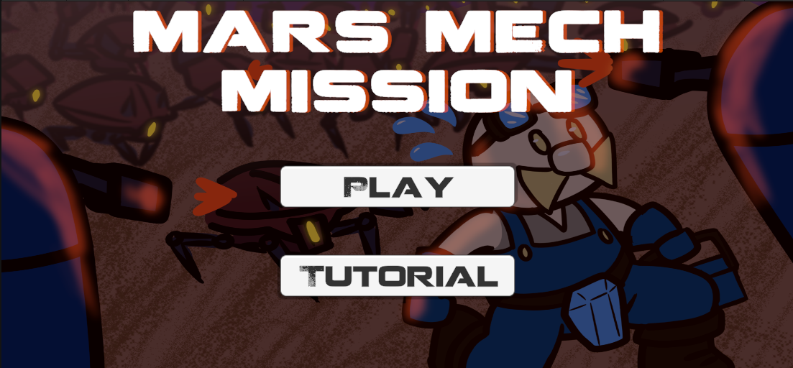

    

_Mars Mech Mission_ is a tower defense game developed on Unity, presented as the final project of my team, I3T4, for ICS 369. You play as a crafty mad scientist stranded and alone on an alien desert. The mission is to survive as long as you can, gathering resources to build contraptions during the day, and defending yourself and your base against robot enemies at night. 

The gameplay is simple. 

As for my role on the team, I did the majority of the 3D art. I modeled and textured the turret, the trap, and the home base. This was a daunting task for me because I had no prior experience of doing 3D animation. I just happened to also be taking ACM 215 (Introduction to 3D Animation) at the time. 

_input pictures here_

One of my teammates, Ben, made the game playable on browser. You can try out the game [here](https://bencatcraw.itch.io/mmm). You can also check out our presentations to see our development process:
- [Game Pitch](https://docs.google.com/presentation/d/1EuSpYwfkZwH5JoPc1cNMVdqTgxxFuLCc1RARd1zp3IM/edit?usp=sharing)
- [Mid-Development Checkpoint](https://docs.google.com/presentation/d/1FVCtFYaMojFh3iPsoLDMwcpRKAXwvjKjtFYo3nWko-g/edit?usp=sharing)
- [Final Presentation](https://docs.google.com/presentation/d/1e8Ov8tu0IcHB7yIpXBsmQmS3V-phJp3_TMtDfx4XpGA/edit?usp=sharing)
