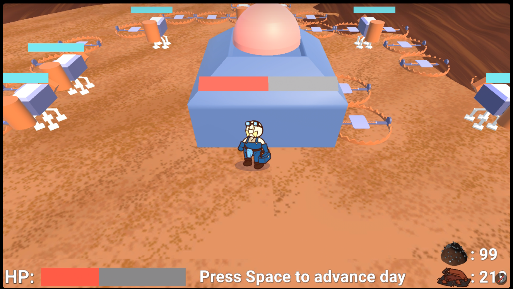

    

_Mars Mech Mission_ is a tower defense game made on Unity, developed as the final project of my team, I3T4, for ICS 369. You play as a crafty mad scientist stranded and alone on an alien desert. The mission is to survive as long as you can, gathering resources to build contraptions during the day, and defending yourself and your base against robot enemies at night. 

The gameplay is simple. There are three stages to each round, or in-game day. During the "morning" phase, you mine titanium ore and pick up scrap metal left by fallen enemies the night before. You can use these materials to build turrets and traps, as well as purchase upgrades to better survive the night. During the "afternoon" phase, you are now able to place down your turrets and traps. You are also able to partially refund what you put down in case you change your mind about placements. In the "evening" phase, your task is to survive. There are two types of robot enemies in the game: a crab-like robot which only targets your base, and a scorpion-like robot which only targets you. If you defeat all enemies thrown at you in this phase, then you'll be able to move on to the next day and start the process all over again. If you or the base's health drops to 0, it's game over.

As for my role on the team, I did the majority of the 3D art. I modeled and textured the turret, the trap, and the home base. This was a daunting task for me because I had no prior experience of doing 3D animation -- I just happened to also be taking ACM 215 at the time, which is Introduction to 3D Animation. To create the models, I used Autodesk Maya, the same software we use for ACM 215. 

One of my teammates, Ben, made the game playable on browser. You can try out the game [here](https://bencatcraw.itch.io/mmm). You can also check out our presentations to see our development process:
- [Game Pitch](https://docs.google.com/presentation/d/1EuSpYwfkZwH5JoPc1cNMVdqTgxxFuLCc1RARd1zp3IM/edit?usp=sharing)
- [Mid-Development Checkpoint](https://docs.google.com/presentation/d/1FVCtFYaMojFh3iPsoLDMwcpRKAXwvjKjtFYo3nWko-g/edit?usp=sharing)
- [Final Presentation](https://docs.google.com/presentation/d/1e8Ov8tu0IcHB7yIpXBsmQmS3V-phJp3_TMtDfx4XpGA/edit?usp=sharing)
