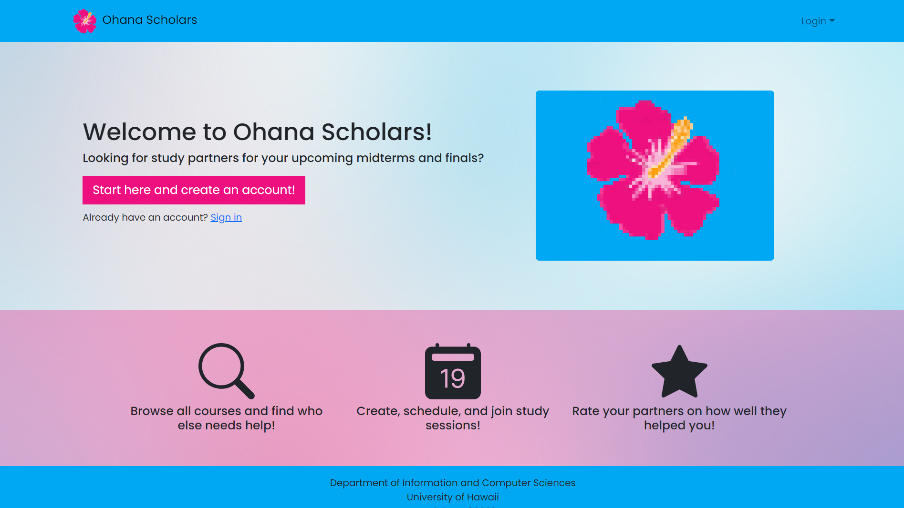
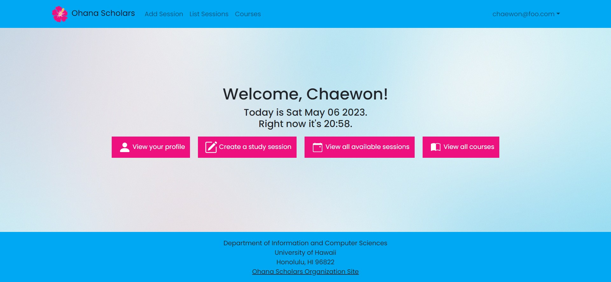
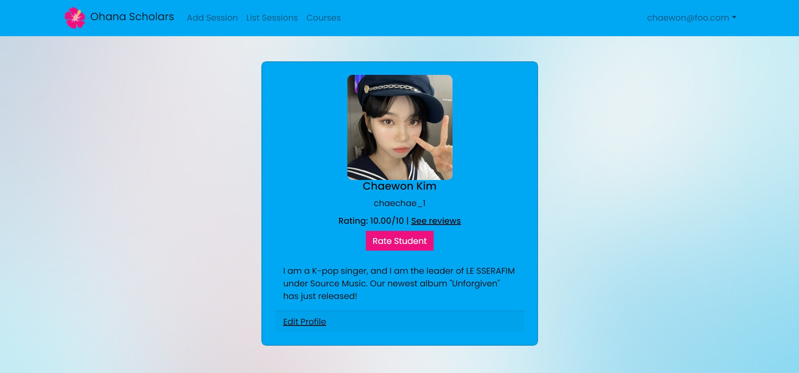

    

[Ohana Scholars](https://ohanascholars.org/) is a website for University of Hawaii students to schedule and sign up for study sessions for various courses in preparation for midterms and finals. The application was built on React Bootstrap and Meteor, which includes MongoDB.Students can schedule sessions for courses in ICS, BIOL, ENG, HIST, among a few others. They can browse through available courses and sessions attached to these courses. When a student signs up for a session, they can be reminded via email about the session. After the session, students can rate their partners on a scale of 1 to 10 on how well they helped them in studying. 

My contributions to the application include a Mongo collection called Reputation, in which each Reputation object includes the user ID of the user (or student) being rated, their rating, the reason for their rating, and the user that did the rating. The intention behind adding this to the application is to give students an incentive to actually be a good help to other students when they meet for a study session. A student's rating is shown on their profile page, where other students can read the reviews they were given, as well as submit their own rating as well. I also worked on the landing page and the home page for when users are logged in. In addition, I contributed to the overall styling of the website, notably with the color scheme and the font family used throughout the application. 

    
    

You can learn more about the Ohana Scholars application and the team on our [project home page](https://ohana-scholars.github.io/).
