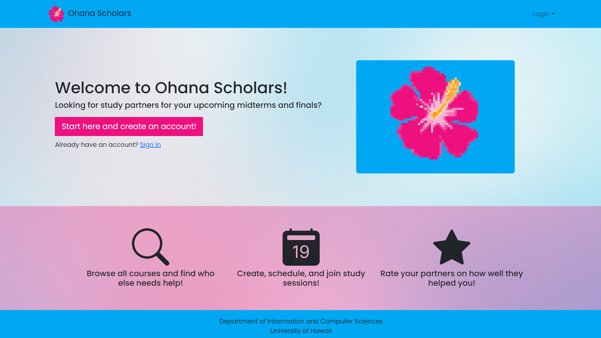

    

[Ohana Scholars](https://ohanascholars.org/) is a website for University of Hawaii students to schedule and sign up for study sessions for various courses in preparation for midterms and finals. 

You can learn more about the Ohana Scholars application and the team on our [project home page](https://ohana-scholars.github.io/).
