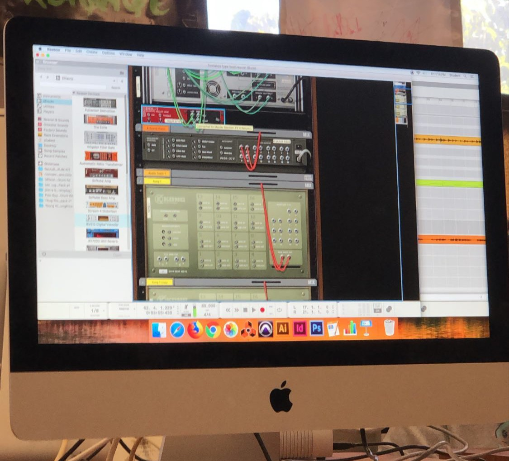

During the 3rd quarter of my senior year of high school, right before the pandemic, my audio engineering class was assigned a group project to produce an original song. The digital audio workspace software we were learning in class was Reason (pictured above), and we needed to use that to produce the song. We were free to choose our own groups, as long as there were at least two people. I was lucky to pair up with a classmate whom I had chemistry with musically. As far as my role in the group, I wrote most of the lyrics, and provided ukulele and vocals to the song. The resulting track was entitled “Something New.”

"Something New" was a song that I had secretly been working on prior to doing the project. The inspiration behind it is unbearably cliche; basically I was crushing hard on a classmate who was already in a relationship, and it was getting to a point where I became desperate.  In retrospect, I have no idea why I thought these lyrics were okay; they’re so sappy they make me cringe. Take the chorus for example:

  *I’ve grown so tired of the same four words 
  / “You’ll find someone else” – it just never works 
  / I wanna hear something new 
  / Something like “I love you” 
  / And I wanna hear it come from you*

I originally did not intend to do anything else with the song, but my partner ultimately convinced me to expand upon the “good ideas” I already had. We took an ukulele ballad and turned it into a chill pop tune influenced by lo-fi hip hop. Working on the song was probably the most fun I had in a group project. A highlight of the process was recording the vocals. It was actually a nerve-wracking experience because we didn't have a separate recording booth in the class. Literally the entire classroom had to be completely quiet while I was singing into the mic. I can normally hold a tune well, but there were some takes where I was embarrassingly off-key. Luckily we were able to record the vocals for the entire song in one session. Upon its completion, the song was well received by the class, so much so that we were chosen to perform it live at our annual arts showcase.

Over the pandemic, I uploaded the song on [SoundCloud](https://soundcloud.com/alden-paroni/something-new?si=d06554077a9f477481f03f4d30ce0e13&utm_source=clipboard&utm_medium=text&utm_campaign=social_sharing). Note: there's 10 seconds of silence before the song actually begins.
