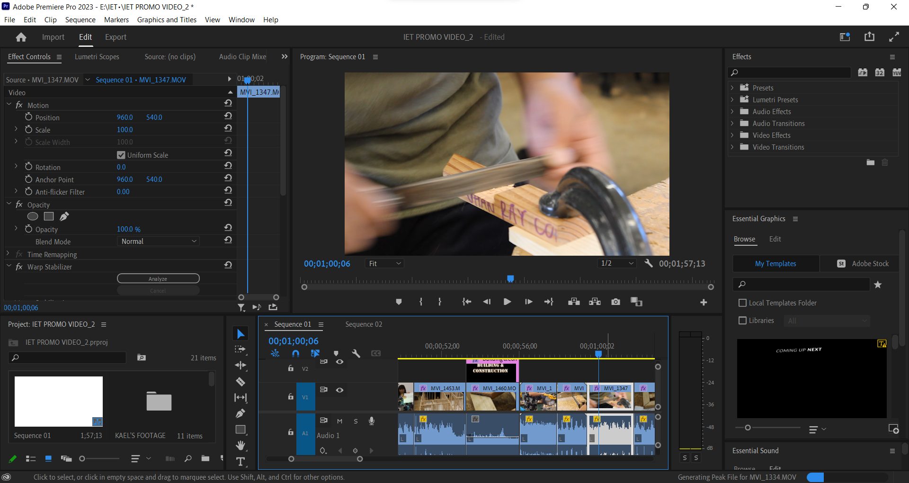

In my senior year at Waipahu High School, when I still wanted to produce videos, I was a member of Marauder Media. The club was undergoing a tumultuous period -- our longtime club advisor suddenly left the year before, leaving the club's future uncertain. Our advisors for the time being were our assistant principals, and the first assignment they gave us was to produce promotional videos for each of the academies in our school which were to be shown at that year's 8th Grade Orientation. Waipahu High School has five academies, each for a general career field: Arts & Communication (AAC), Natural Resources (ANR), Professional & Public Services (APPS), Health & Sciences (AHS), and Industrial & Engineering Technology (IET). The club was split into groups to produce a video for one academy, which in of itself has different career pathways we needed to highlight. My group was assigned the latter academy; I was the primary editor, editing on Adobe Premiere Pro, but I also shot additional footage. 

This was undoubtedly the most collaborative I had ever been on a video. Just as I was solely in charge of the editing, I had one teammate in charge of creating title graphics on Adobe After Effects, and a couple other teammates in charge of recording footage for all 8 IET pathways. For once, I needed to trust my teammates to pull their weight. Throughout the course of the production, our team kept close communication with the IET academy principal and teachers. We made sure to show the best of what each pathway had to offer, so that the final cut could be approved. 

Although I'm happy for the most part with the final cut, there are still several things I feel I could have changed to improve its quality. Then again, to be fair, we were on a tight schedule, which led way to a fair share of technical issues. Not all the graphics my teammate made came out right when I imported them onto Premiere Pro. When you watch the video, you will notice some title graphics are more dynamic than others. The video features interviews of the academy heads, varying in audio quality. I struggled the most with balancing the interview audio with b-roll audio, as well as the background music. In retrospect, I could have done away with the b-roll audio and saved myself the trouble. Despite these issues, my opinion on this video does not change. This is honestly one of the better videos I had the pleasure of being a part of. 

I have the final cut uploaded and unlisted on [YouTube](https://www.youtube.com/watch?v=KEpmeSflFt8). 