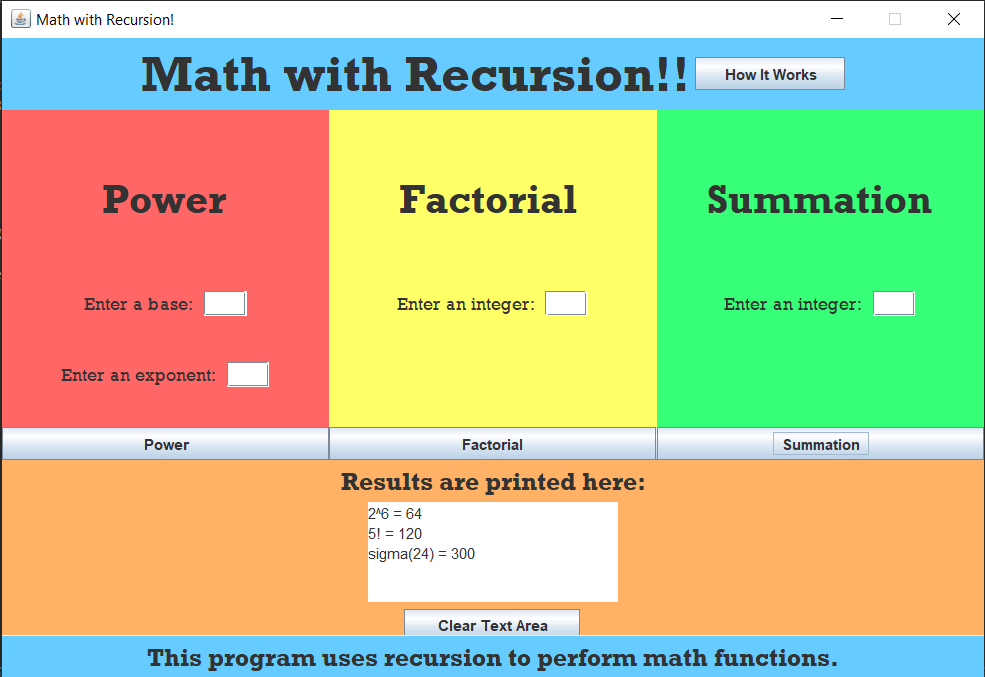

In one of the later assignments in ICS 211, I needed to use what I learned about graphical user interfaces and recursion to create a GUI that calculated exponents, factorials, and summations recursively given the user's input. This was an individual assignment, but in this asynchronous class I was lucky to have a high school friend as my classmate and study buddy. Throughout the semester we would work on these assignments together, but made sure to write our own code. Frequently during our Discord study sessions we'd bounce ideas off each other and overall help each other out. 

Using jGRASP, there were two .java files we needed to submit: a class that set up the GUI and its functions, and a driver class to run the GUI. Most of the time spent working on this assignment was on setting up the GUI alone. I had never written so many lines of code for one assignment, but it was worth making sure my GUI looked balanced and aesthetically pleasing. I declared quite a few "empty" labels with five spaces as the string to center the actual text. Aiming to make a visual pop, I changed the font of the text from the default Arial to Rockwell, and incorporated pastel colors. You can never trust the user to enter valid inputs, so I needed to write custom exceptions to keep the user in check. 

Here's a portion of my code that features a custom exception being thrown:

```java
    int base = Integer.parseInt(bUser.getText());      // change data type to int
    int exponent = Integer.parseInt(eUser.getText());
    if (base <= 0 || exponent < 0) {     // triggers a pop-up if any negative int is entered
        JOptionPane.showMessageDialog(new JFrame(),
            "Error: You did not enter a positive integer!",
            "ICS-211 Exception",
            JOptionPane.ERROR_MESSAGE);
        bUser.setText("");   // clears text field
        eUser.setText("");
    }
```

Recursion was a relatively new concept to me at the time, and so I created separate .java files to make sure each math method ran perfectly. 

Here's my code for a recursive method that calculates exponents:

```java
   /**
    * Recursive method to perform the exponential operation.
    *
    * @param      base        The number multiplying to itself
    * @param      exponent    The number of times the base will multiply itself
    * @return     product     The end result
    */
   public int power(int base, int exponent) {
      int product;
      if (exponent == 0) {
         product = 1;
         return product;
      }
      else {
         product = base * power(base, (exponent - 1));
         return product;
      }
   }
```