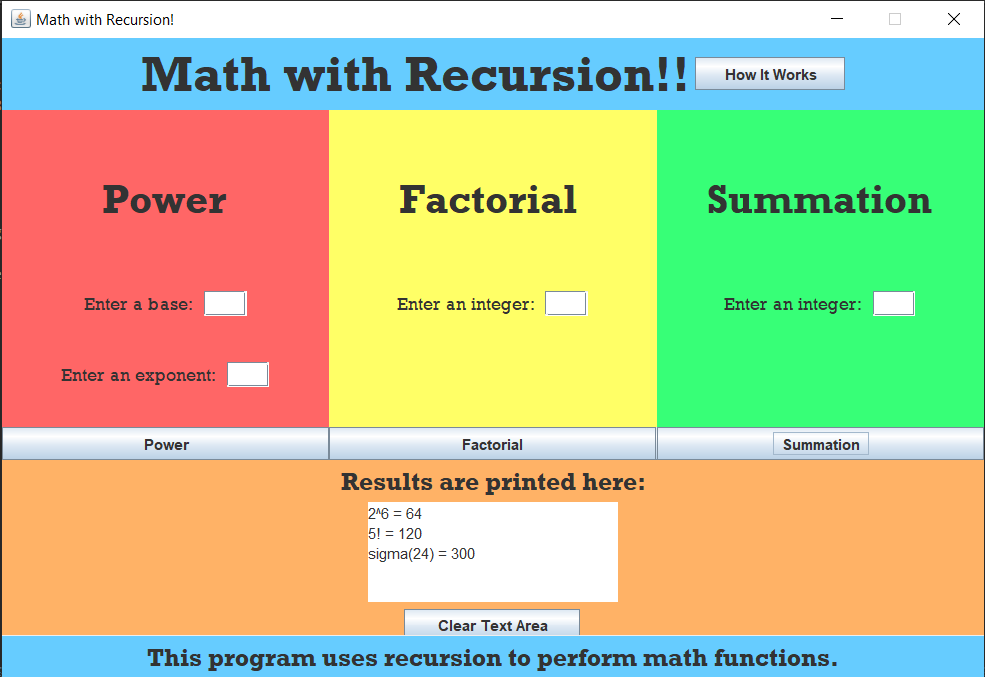

In one of the later assignments in ICS 211, I needed to use what I learned about graphical user interfaces and recursion to create a GUI that calculated exponents, factorials, and summations recursively given the user's input. I had never written so many lines of code for one assignment. Most of the time I spent working on this assignment was just setting up the GUI in a way that looked balanced and aesthetically pleasing. I think I succeeded in that regard. Recursion was a relatively new concept to me at the time, and so I created separate .java files to make sure each math method ran perfectly. 

Here's my code for a recursive method that calculates exponents:

```agsl
   /**
    * Recursive method to perform the exponential operation.
    *
    * @param      base        The number multiplying to itself
    * @param      exponent    The number of times the base will multiply itself
    * @return     product     The end result
    */
   public int power(int base, int exponent) {
      int product;
      if (exponent == 0) {
         product = 1;
         return product;
      }
      else {
         product = base * power(base, (exponent - 1));
         return product;
      }
   }
```