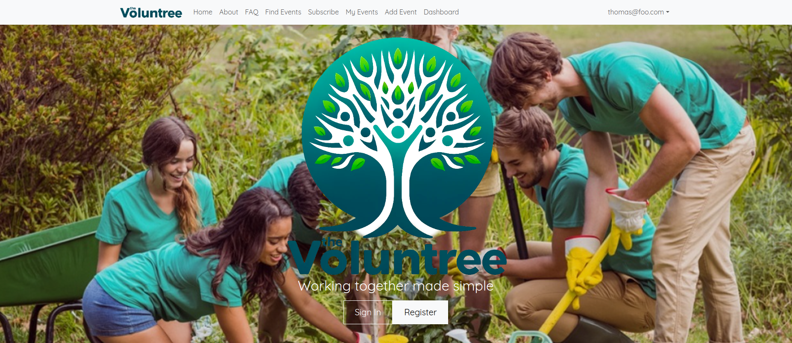

    

The structure of ICS 414 revolves completely around a single group project developing a React web application for a real client. The class was split into groups of 6 to 8 people, all tasked with developing a web app for Voluntree given her requirements and requests. 

Voluntree is a non-profit organization founded by Sara Henley with the mission to help aspiring volunteers find community service opportunities and connect with organizers. I interpreted Sara's general idea for Voluntree as "LinkedIn for community service". 

It took a few weeks to settle into a role within the team. My main contributions were to the profile pages, a portion of the styling, and the integration tests via TestCafe. 

You can learn more about our group project in the development site [here](https://ube-dev.github.io/).
